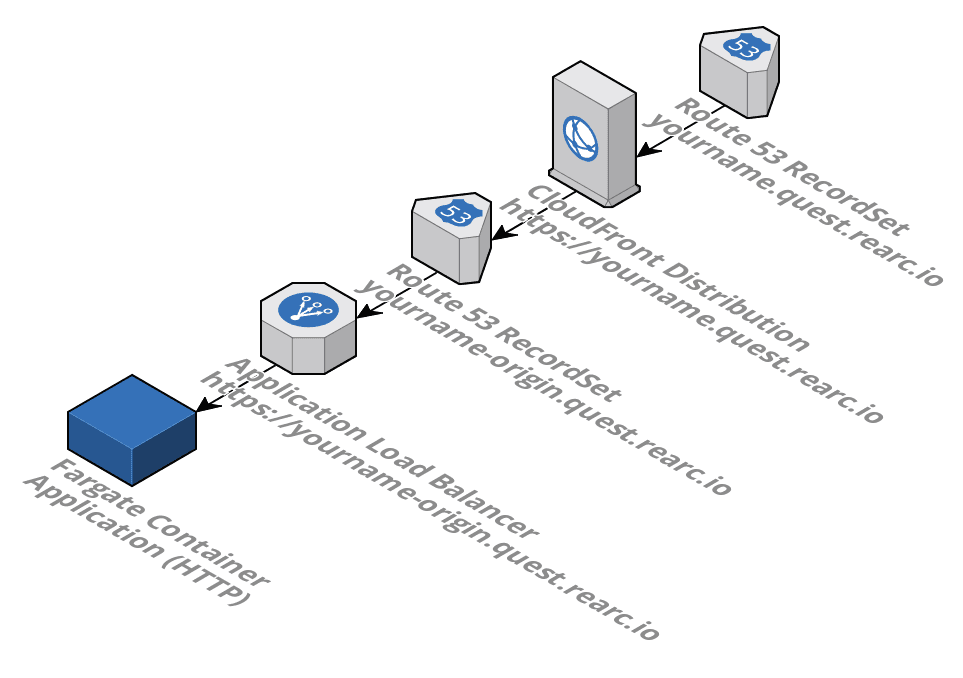

# Rearc DevOps Quest - Mark I

Welcome to the first Rearc Quest through the turbulent landscape of DevOps! We
need your help to create templates and tools to save the land.

## Requirements
- Run the included application as a Docker container on AWS Fargate.
- https://`yourname`.quest.rearc.io should direct to the app from the internet.
- Create a CloudFormation template that creates all AWS resources (see below)

## Environment
- AWS Account - Noop Playground
- Region - Ohio (us-east-2)
- Route 53 Hosted Zone - quest.rearc.io (Z1BEOO2A5FWP1D)

## Instructions
- Start by cloning this repo and creating your own branch named after yourself.
- Create the CloudFormation template and launch a stack.
- Demonstrate the site loading from `yourname`.quest.rearc.io to your Guide with your name on the Survivors List.

## CloudFormation Template
Create a CloudFormation template within the project under `./cloudformation.json`
which includes the following AWS resources your app will need. Once your quest is complete, deleting the CloudFormation stack should deprovision all resources.
- Networking Components including a VPC, Subnets, IGW, Route Tables
- ECS Cluster and Service using Fargate
- Application Load Balancer
- CloudFront Distribution
- Route 53 RecordSet in the zone mentioned above for `yourname`.quest.rearc.io
  directed at the CloudFront Distribution.
- Route 53 RecordSet in the zone mentioned above for `yourname`-origin.quest.rearc.io
  directed at the ALB.
- ACM Certificate requested for `yourname`.quest.rearc.io and applied to the
  CloudFront Distribution.
- ACM Certificate requested for `yourname`-origin.quest.rearc.io and applied
  to the ALB.
- Security Group for application container allowing only the ALB inbound on 80
- Security Group for the ALB to be accessed on 443 from 0.0.0.0/0

## Application Architecture

